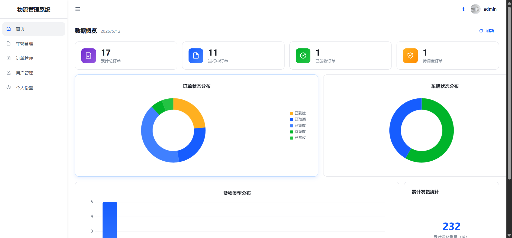

# LMS 物流管理系统前端

基于 Vue 3 + TypeScript + Arco Design Vue 的物流管理系统管理后台，支持多角色权限管理、车辆调度、订单跟踪等功能。

## 项目简介

本项目是一个功能完善的物流管理系统前端，采用 RBAC（基于角色的访问控制）权限模型，为不同角色提供定制化的操作界面和功能权限。

**后端项目地址：** [lms-bank](https://github.com/thisRandom/lms-bank)

## 功能特性

### 多角色权限管理
系统支持 4 种角色，每个角色拥有独立的菜单和功能权限：
- **管理员（ADMIN）**：系统全部功能，包括用户管理、车辆管理、订单管理、调度管理等
- **调度员（DISPATCHER）**：车辆调度、订单分配、位置监控等
- **司机（DRIVER）**：查看分配的订单、更新运输状态
- **客户（CUSTOMER）**：查看自己的订单、下单

### 核心功能模块
| 模块 | 说明 |
|------|------|
| 用户管理 | 用户增删改查、角色分配 |
| 车辆管理 | 车辆信息维护、状态管理 |
| 订单管理 | 订单创建、跟踪、状态更新 |
| 调度管理 | 车辆调度、任务分配 |
| 位置追踪 | 地图展示车辆实时位置坐标 |

### 技术亮点
- **RBAC 权限控制**：路由级别 + 菜单级别的细粒度权限控制
- **地图集成**：可视化展示车辆位置坐标，实时追踪运输状态
- **密码安全**：登录密码采用 AES 加密传输
- **响应式布局**：适配不同屏幕尺寸



## 快速开始

### 环境要求
- Node.js >= 16
- npm >= 8

### 安装与运行

```bash
# 克隆项目
git clone https://github.com/your-username/lms_front.git

# 安装依赖
npm install

# 启动开发服务器
npm run dev
```

### 启动后端服务

本项目需要配合后端服务使用，请先启动后端：

```bash
# 克隆后端项目
git clone https://github.com/thisRandom/lms-bank.git

# 按后端项目说明启动服务（默认端口 8080）
```

## 项目结构

```
src/
├── api/           # API 接口定义
├── assets/        # 静态资源
├── layouts/       # 布局组件
├── router/        # 路由配置与权限守卫
├── stores/        # Pinia 状态管理
├── utils/         # 工具函数（请求封装、加密、认证）
└── views/         # 页面组件
    ├── loginView.vue        # 登录页
    ├── dashboard.vue        # 仪表盘
    ├── userManage.vue       # 用户管理
    ├── vehicleManage.vue    # 车辆管理
    ├── orderManage.vue      # 订单管理
    ├── dispatchManage.vue   # 调度管理
    ├── locationManage.vue   # 位置追踪
    └── userSetting.vue      # 个人设置
```

## 技术栈

- **框架**：Vue 3 + TypeScript
- **构建工具**：Vite
- **UI 组件库**：Arco Design Vue
- **状态管理**：Pinia
- **路由**：Vue Router 4
- **HTTP 请求**：Axios
- **密码加密**：CryptoJS (AES)

## 开发命令

```bash
npm run dev          # 启动开发服务器
npm run build        # 构建生产版本
npm run type-check   # 类型检查
npm run preview      # 预览生产构建
```

## License

MIT
