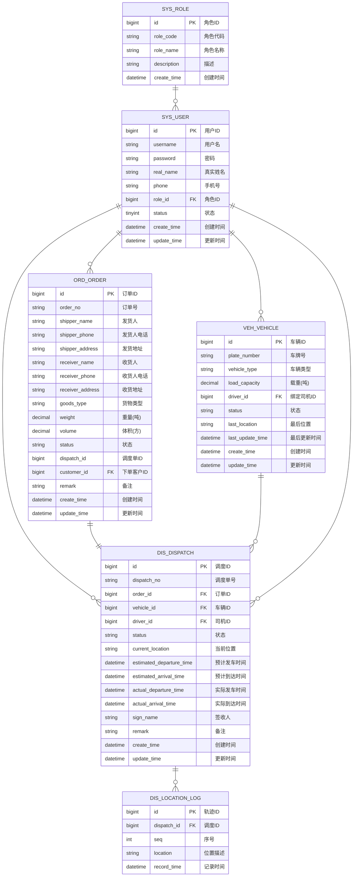

# 物流管理系统 - 数据模型设计文档

## 1. 概述

### 1.1 设计目标
- 支持物流管理系统核心业务
- 满足订单、车辆、调度、用户管理需求
- 预留扩展性，便于后续功能迭代

### 1.2 设计原则
- 第三范式（3NF），减少数据冗余
- 主键统一使用自增 BIGINT
- 统一使用 `create_time`、`update_time` 审计字段
- 统一使用下划线命名法（数据库规范）
- 表名规范：`模块前缀_表名`，便于协作开发

### 1.3 表命名规范

| 模块 | 前缀 | 表名示例 | 说明 |
|------|------|----------|------|
| 用户模块 | sys | sys_user | 系统用户表 |
| 车辆模块 | veh | veh_vehicle | 车辆表 |
| 订单模块 | ord | ord_order | 订单表（order是SQL保留字，用ord） |
| 调度模块 | dis | dis_dispatch | 调度表 |

---

## 2. ER 图

### 2.1 整体 ER 图



### 2.2 实体关系说明

| 关系 | 说明 | 备注 |
|------|------|------|
| 角色 → 用户 | 1:N | 一个角色可分配给多个用户 |
| 用户 → 车辆 | 1:N | 一个用户可以绑定多辆车 |
| 用户 → 订单 | 1:N | 一个客户可以下多个订单 |
| 用户 → 调度 | 1:N | 一个调度员可以创建多个调度单 |
| 订单 → 调度 | 1:1 | 一个订单对应一个调度单 |
| 车辆 → 调度 | 1:N | 一辆车可执行多个调度任务 |
| 用户 → 调度 | 1:N | 一个司机可执行多个调度任务 |

---

## 3. 数据表详细设计

### 3.1 角色表 (sys_role)

| 字段名 | 类型 | 约束 | 说明 |
|--------|------|------|------|
| id | BIGINT | PK, AUTO_INCREMENT | 角色ID |
| role_code | VARCHAR(20) | NOT NULL, UNIQUE | 角色代码 |
| role_name | VARCHAR(50) | NOT NULL | 角色名称 |
| description | VARCHAR(200) | | 描述 |
| create_time | DATETIME | DEFAULT CURRENT_TIMESTAMP | 创建时间 |

**建表 SQL：**
```sql
CREATE TABLE sys_role (
    id BIGINT PRIMARY KEY AUTO_INCREMENT COMMENT '角色ID',
    role_code VARCHAR(20) NOT NULL UNIQUE COMMENT '角色代码',
    role_name VARCHAR(50) NOT NULL COMMENT '角色名称',
    description VARCHAR(200) COMMENT '描述',
    create_time DATETIME DEFAULT CURRENT_TIMESTAMP COMMENT '创建时间',
    INDEX idx_role_code (role_code)
) ENGINE=InnoDB DEFAULT CHARSET=utf8mb4 COMMENT='角色表';
```

**角色说明：**
| 角色代码 | 角色名称 | 说明 |
|----------|----------|------|
| ADMIN | 管理员 | 系统全部功能 |
| DISPATCHER | 调度员 | 订单调度、车辆管理 |
| DRIVER | 司机 | 执行运输任务 |
| CUSTOMER | 客户 | 下单、查订单 |

---

### 3.2 用户表 (sys_user)

| 字段名 | 类型 | 约束 | 说明 |
|--------|------|------|------|
| id | BIGINT | PK, AUTO_INCREMENT | 用户ID |
| username | VARCHAR(50) | NOT NULL, UNIQUE | 用户名（登录账号） |
| password | VARCHAR(100) | NOT NULL | 密码（加密存储） |
| real_name | VARCHAR(50) | | 真实姓名 |
| phone | VARCHAR(20) | | 手机号 |
| role_id | BIGINT | NOT NULL, FK | 角色ID |
| status | TINYINT | DEFAULT 1 | 状态：0禁用 1启用 |
| create_time | DATETIME | DEFAULT CURRENT_TIMESTAMP | 创建时间 |
| update_time | DATETIME | ON UPDATE CURRENT_TIMESTAMP | 更新时间 |

**建表 SQL：**
```sql
CREATE TABLE sys_user (
    id BIGINT PRIMARY KEY AUTO_INCREMENT COMMENT '用户ID',
    username VARCHAR(50) NOT NULL UNIQUE COMMENT '用户名',
    password VARCHAR(100) NOT NULL COMMENT '密码',
    real_name VARCHAR(50) COMMENT '真实姓名',
    phone VARCHAR(20) COMMENT '手机号',
    role_id BIGINT NOT NULL COMMENT '角色ID',
    status TINYINT DEFAULT 1 COMMENT '状态：0禁用 1启用',
    create_time DATETIME DEFAULT CURRENT_TIMESTAMP COMMENT '创建时间',
    update_time DATETIME DEFAULT CURRENT_TIMESTAMP ON UPDATE CURRENT_TIMESTAMP COMMENT '更新时间',
    INDEX idx_username (username),
    INDEX idx_role_id (role_id),
    INDEX idx_status (status),
    CONSTRAINT fk_user_role FOREIGN KEY (role_id) REFERENCES sys_role(id)
) ENGINE=InnoDB DEFAULT CHARSET=utf8mb4 COMMENT='用户表';
```

### 3.3 车辆表 (veh_vehicle)

| 字段名 | 类型 | 约束 | 说明 |
|--------|------|------|------|
| id | BIGINT | PK, AUTO_INCREMENT | 车辆ID |
| plate_number | VARCHAR(20) | NOT NULL, UNIQUE | 车牌号 |
| vehicle_type | VARCHAR(20) | NOT NULL | 车辆类型：TRUCK/VAN/PICKUP |
| load_capacity | DECIMAL(10,2) | | 载重（吨） |
| driver_id | BIGINT | FK → sys_user(id) | 绑定司机ID |
| status | VARCHAR(20) | DEFAULT 'IDLE' | 状态：IDLE空闲/BUSY运输中/MAINTENANCE维修 |
| last_location | VARCHAR(200) | | 最后位置 |
| last_update_time | DATETIME | | 位置更新时间 |
| create_time | DATETIME | DEFAULT CURRENT_TIMESTAMP | 创建时间 |
| update_time | DATETIME | ON UPDATE CURRENT_TIMESTAMP | 更新时间 |

**建表 SQL：**
```sql
CREATE TABLE veh_vehicle (
    id BIGINT PRIMARY KEY AUTO_INCREMENT COMMENT '车辆ID',
    plate_number VARCHAR(20) NOT NULL UNIQUE COMMENT '车牌号',
    vehicle_type VARCHAR(20) NOT NULL DEFAULT 'TRUCK' COMMENT '车辆类型：TRUCK/VAN/PICKUP',
    load_capacity DECIMAL(10,2) COMMENT '载重（吨）',
    driver_id BIGINT COMMENT '绑定司机ID',
    status VARCHAR(20) DEFAULT 'IDLE' COMMENT '状态：IDLE空闲/BUSY运输中/MAINTENANCE维修',
    last_location VARCHAR(200) COMMENT '最后位置',
    last_update_time DATETIME COMMENT '位置更新时间',
    create_time DATETIME DEFAULT CURRENT_TIMESTAMP COMMENT '创建时间',
    update_time DATETIME DEFAULT CURRENT_TIMESTAMP ON UPDATE CURRENT_TIMESTAMP COMMENT '更新时间',
    INDEX idx_plate_number (plate_number),
    INDEX idx_status (status),
    INDEX idx_driver_id (driver_id),
    CONSTRAINT fk_veh_driver FOREIGN KEY (driver_id) REFERENCES sys_user(id)
) ENGINE=InnoDB DEFAULT CHARSET=utf8mb4 COMMENT='车辆表';
```

**车辆类型说明：**
| 类型代码 | 说明 |
|----------|------|
| TRUCK | 货车（大型） |
| VAN | 厢式货车（中型） |
| PICKUP | 皮卡（小型） |

**车辆状态说明：**
| 状态代码 | 说明 | 业务含义 |
|----------|------|----------|
| IDLE | 空闲 | 可接受调度 |
| BUSY | 运输中 | 正在执行运输任务 |
| MAINTENANCE | 维修中 | 不可用 |

---

### 3.4 订单表 (ord_order)

| 字段名 | 类型 | 约束 | 说明 |
|--------|------|------|------|
| id | BIGINT | PK, AUTO_INCREMENT | 订单ID |
| order_no | VARCHAR(50) | NOT NULL, UNIQUE | 订单号（系统生成） |
| shipper_name | VARCHAR(50) | NOT NULL | 发货人姓名 |
| shipper_phone | VARCHAR(20) | NOT NULL | 发货人电话 |
| shipper_address | VARCHAR(200) | NOT NULL | 发货详细地址 |
| receiver_name | VARCHAR(50) | NOT NULL | 收货人姓名 |
| receiver_phone | VARCHAR(20) | NOT NULL | 收货人电话 |
| receiver_address | VARCHAR(200) | NOT NULL | 收货详细地址 |
| goods_type | VARCHAR(50) | | 货物类型 |
| weight | DECIMAL(10,2) | | 货物重量（吨） |
| volume | DECIMAL(10,2) | | 货物体积（方） |
| status | VARCHAR(20) | DEFAULT 'PENDING' | 状态 |
| dispatch_id | BIGINT | | 关联调度单ID |
| customer_id | BIGINT | FK → sys_user(id) | 下单客户ID |
| remark | VARCHAR(500) | | 备注 |
| create_time | DATETIME | DEFAULT CURRENT_TIMESTAMP | 创建时间 |
| update_time | DATETIME | ON UPDATE CURRENT_TIMESTAMP | 更新时间 |

**建表 SQL：**
```sql
CREATE TABLE ord_order (
    id BIGINT PRIMARY KEY AUTO_INCREMENT COMMENT '订单ID',
    order_no VARCHAR(50) NOT NULL UNIQUE COMMENT '订单号',
    shipper_name VARCHAR(50) NOT NULL COMMENT '发货人姓名',
    shipper_phone VARCHAR(20) NOT NULL COMMENT '发货人电话',
    shipper_address VARCHAR(200) NOT NULL COMMENT '发货详细地址',
    receiver_name VARCHAR(50) NOT NULL COMMENT '收货人姓名',
    receiver_phone VARCHAR(20) NOT NULL COMMENT '收货人电话',
    receiver_address VARCHAR(200) NOT NULL COMMENT '收货详细地址',
    goods_type VARCHAR(50) COMMENT '货物类型',
    weight DECIMAL(10,2) COMMENT '货物重量（吨）',
    volume DECIMAL(10,2) COMMENT '货物体积（方）',
    status VARCHAR(20) DEFAULT 'PENDING' COMMENT '状态',
    dispatch_id BIGINT COMMENT '关联调度单ID',
    customer_id BIGINT COMMENT '下单客户ID',
    remark VARCHAR(500) COMMENT '备注',
    create_time DATETIME DEFAULT CURRENT_TIMESTAMP COMMENT '创建时间',
    update_time DATETIME DEFAULT CURRENT_TIMESTAMP ON UPDATE CURRENT_TIMESTAMP COMMENT '更新时间',
    INDEX idx_order_no (order_no),
    INDEX idx_status (status),
    INDEX idx_customer_id (customer_id),
    INDEX idx_create_time (create_time),
    INDEX idx_dispatch_id (dispatch_id),
    CONSTRAINT fk_ord_customer FOREIGN KEY (customer_id) REFERENCES sys_user(id)
) ENGINE=InnoDB DEFAULT CHARSET=utf8mb4 COMMENT='订单表';
```

**订单状态说明：**
| 状态代码 | 说明 | 可转换状态 |
|----------|------|------------|
| PENDING | 待调度 | DISPATCHED, CANCELLED |
| DISPATCHED | 已调度 | IN_TRANSIT |
| IN_TRANSIT | 运输中 | ARRIVED |
| ARRIVED | 已到达 | SIGNED |
| SIGNED | 已签收 | （终态） |
| CANCELLED | 已取消 | （终态） |

**订单号生成规则：**
```
前缀 + 年月日(8位) + 序号(4位)
例如：ORD202604230001
```

---

### 3.5 调度表 (dis_dispatch)

| 字段名 | 类型 | 约束 | 说明 |
|--------|------|------|------|
| id | BIGINT | PK, AUTO_INCREMENT | 调度ID |
| dispatch_no | VARCHAR(50) | NOT NULL, UNIQUE | 调度单号 |
| order_id | BIGINT | NOT NULL, FK | 关联订单ID |
| vehicle_id | BIGINT | NOT NULL, FK | 分配车辆ID |
| driver_id | BIGINT | NOT NULL, FK | 分配司机ID |
| status | VARCHAR(20) | DEFAULT 'ASSIGNED' | 状态 |
| current_location | VARCHAR(200) | | 当前位置 |
| estimated_departure_time | DATETIME | | 预计发车时间 |
| estimated_arrival_time | DATETIME | | 预计到达时间 |
| actual_departure_time | DATETIME | | 实际发车时间 |
| actual_arrival_time | DATETIME | | 实际到达时间 |
| sign_name | VARCHAR(50) | | 签收人姓名 |
| remark | VARCHAR(500) | | 备注 |
| create_time | DATETIME | DEFAULT CURRENT_TIMESTAMP | 创建时间 |
| update_time | DATETIME | ON UPDATE CURRENT_TIMESTAMP | 更新时间 |

**建表 SQL：**
```sql
CREATE TABLE dis_dispatch (
    id BIGINT PRIMARY KEY AUTO_INCREMENT COMMENT '调度ID',
    dispatch_no VARCHAR(50) NOT NULL UNIQUE COMMENT '调度单号',
    order_id BIGINT NOT NULL COMMENT '关联订单ID',
    vehicle_id BIGINT NOT NULL COMMENT '分配车辆ID',
    driver_id BIGINT NOT NULL COMMENT '分配司机ID',
    status VARCHAR(20) DEFAULT 'ASSIGNED' COMMENT '状态',
    current_location VARCHAR(200) COMMENT '当前位置',
    estimated_departure_time DATETIME COMMENT '预计发车时间',
    estimated_arrival_time DATETIME COMMENT '预计到达时间',
    actual_departure_time DATETIME COMMENT '实际发车时间',
    actual_arrival_time DATETIME COMMENT '实际到达时间',
    sign_name VARCHAR(50) COMMENT '签收人姓名',
    remark VARCHAR(500) COMMENT '备注',
    create_time DATETIME DEFAULT CURRENT_TIMESTAMP COMMENT '创建时间',
    update_time DATETIME DEFAULT CURRENT_TIMESTAMP ON UPDATE CURRENT_TIMESTAMP COMMENT '更新时间',
    INDEX idx_dispatch_no (dispatch_no),
    INDEX idx_order_id (order_id),
    INDEX idx_vehicle_id (vehicle_id),
    INDEX idx_driver_id (driver_id),
    INDEX idx_status (status),
    CONSTRAINT fk_dis_order FOREIGN KEY (order_id) REFERENCES ord_order(id),
    CONSTRAINT fk_dis_vehicle FOREIGN KEY (vehicle_id) REFERENCES veh_vehicle(id),
    CONSTRAINT fk_dis_driver FOREIGN KEY (driver_id) REFERENCES sys_user(id)
) ENGINE=InnoDB DEFAULT CHARSET=utf8mb4 COMMENT='调度表';
```

**调度状态说明：**
| 状态代码 | 说明 | 可转换状态 |
|----------|------|------------|
| ASSIGNED | 已分配 | IN_TRANSIT, CANCELLED |
| IN_TRANSIT | 运输中 | ARRIVED, EXCEPTION |
| ARRIVED | 已到达 | SIGNED |
| SIGNED | 已签收 | （终态） |
| EXCEPTION | 异常 | （终态） |
| CANCELLED | 已取消 | （终态） |

**调度单号生成规则：**
```
前缀 + 年月日(8位) + 序号(4位)
例如：DIS202604230001
```

---

### 3.6 轨迹记录表 (dis_location_log)

| 字段名 | 类型 | 约束 | 说明 |
|--------|------|------|------|
| id | BIGINT | PK, AUTO_INCREMENT | 轨迹ID |
| dispatch_id | BIGINT | NOT NULL, FK | 调度ID |
| seq | INT | NOT NULL | 序号（0=起点） |
| location | VARCHAR(200) | | 位置描述 |
| record_time | DATETIME | NOT NULL | 记录时间 |

**建表 SQL：**
```sql
CREATE TABLE dis_location_log (
    id BIGINT PRIMARY KEY AUTO_INCREMENT COMMENT '轨迹ID',
    dispatch_id BIGINT NOT NULL COMMENT '调度ID',
    seq INT NOT NULL COMMENT '序号（0=起点）',
    location VARCHAR(200) COMMENT '位置描述',
    record_time DATETIME NOT NULL COMMENT '记录时间',
    INDEX idx_dispatch_id (dispatch_id),
    INDEX idx_dispatch_seq (dispatch_id, seq),
    CONSTRAINT fk_location_dispatch FOREIGN KEY (dispatch_id) REFERENCES dis_dispatch(id)
) ENGINE=InnoDB DEFAULT CHARSET=utf8mb4 COMMENT='轨迹记录表';
```

**前端实现方式：**
```
位置描述列表 + 直线连接 → 简易轨迹图

例如：["北京" → "石家庄" → "郑州" → "武汉"]
        ●───────────●───────────●───────────●
       起点        途经1       途经2        终点
```

- 前端按 `seq` 排序获取所有点
- 用 SVG/Canvas 或 div 把点用直线连起来
- 无需地图API，纯前端渲染

---

## 4. 完整建表脚本

```sql
-- ============================================
-- 物流管理系统 - 数据库初始化脚本
-- 数据库名：lms
-- 建表顺序：角色表 → 用户表 → 车辆表 → 订单表 → 调度表 → 轨迹记录表
-- ============================================

CREATE DATABASE IF NOT EXISTS lms DEFAULT CHARSET=utf8mb4 COLLATE=utf8mb4_unicode_ci;
USE lms;

-- -------------------------------------------
-- 1. 角色表 (sys_role)
-- -------------------------------------------
DROP TABLE IF EXISTS sys_role;
CREATE TABLE sys_role (
    id BIGINT PRIMARY KEY AUTO_INCREMENT COMMENT '角色ID',
    role_code VARCHAR(20) NOT NULL UNIQUE COMMENT '角色代码',
    role_name VARCHAR(50) NOT NULL COMMENT '角色名称',
    description VARCHAR(200) COMMENT '描述',
    create_time DATETIME DEFAULT CURRENT_TIMESTAMP COMMENT '创建时间',
    INDEX idx_role_code (role_code)
) ENGINE=InnoDB DEFAULT CHARSET=utf8mb4 COMMENT='角色表';

-- -------------------------------------------
-- 2. 用户表 (sys_user)
-- -------------------------------------------
DROP TABLE IF EXISTS sys_user;
CREATE TABLE sys_user (
    id BIGINT PRIMARY KEY AUTO_INCREMENT COMMENT '用户ID',
    username VARCHAR(50) NOT NULL UNIQUE COMMENT '用户名',
    password VARCHAR(100) NOT NULL COMMENT '密码',
    real_name VARCHAR(50) COMMENT '真实姓名',
    phone VARCHAR(20) COMMENT '手机号',
    role_id BIGINT NOT NULL COMMENT '角色ID',
    status TINYINT DEFAULT 1 COMMENT '状态：0禁用 1启用',
    create_time DATETIME DEFAULT CURRENT_TIMESTAMP COMMENT '创建时间',
    update_time DATETIME DEFAULT CURRENT_TIMESTAMP ON UPDATE CURRENT_TIMESTAMP COMMENT '更新时间',
    INDEX idx_username (username),
    INDEX idx_role_id (role_id),
    INDEX idx_status (status),
    CONSTRAINT fk_user_role FOREIGN KEY (role_id) REFERENCES sys_role(id)
) ENGINE=InnoDB DEFAULT CHARSET=utf8mb4 COMMENT='用户表';

-- -------------------------------------------
-- 2. 车辆表 (veh_vehicle)
-- -------------------------------------------
DROP TABLE IF EXISTS veh_vehicle;
CREATE TABLE veh_vehicle (
    id BIGINT PRIMARY KEY AUTO_INCREMENT COMMENT '车辆ID',
    plate_number VARCHAR(20) NOT NULL UNIQUE COMMENT '车牌号',
    vehicle_type VARCHAR(20) NOT NULL DEFAULT 'TRUCK' COMMENT '车辆类型：TRUCK/VAN/PICKUP',
    load_capacity DECIMAL(10,2) COMMENT '载重（吨）',
    driver_id BIGINT COMMENT '绑定司机ID',
    status VARCHAR(20) DEFAULT 'IDLE' COMMENT '状态：IDLE空闲/BUSY运输中/MAINTENANCE维修',
    last_location VARCHAR(200) COMMENT '最后位置',
    last_update_time DATETIME COMMENT '位置更新时间',
    create_time DATETIME DEFAULT CURRENT_TIMESTAMP COMMENT '创建时间',
    update_time DATETIME DEFAULT CURRENT_TIMESTAMP ON UPDATE CURRENT_TIMESTAMP COMMENT '更新时间',
    INDEX idx_plate_number (plate_number),
    INDEX idx_status (status),
    INDEX idx_driver_id (driver_id),
    CONSTRAINT fk_veh_driver FOREIGN KEY (driver_id) REFERENCES sys_user(id)
) ENGINE=InnoDB DEFAULT CHARSET=utf8mb4 COMMENT='车辆表';

-- -------------------------------------------
-- 3. 订单表 (ord_order)
-- -------------------------------------------
DROP TABLE IF EXISTS ord_order;
CREATE TABLE ord_order (
    id BIGINT PRIMARY KEY AUTO_INCREMENT COMMENT '订单ID',
    order_no VARCHAR(50) NOT NULL UNIQUE COMMENT '订单号',
    shipper_name VARCHAR(50) NOT NULL COMMENT '发货人姓名',
    shipper_phone VARCHAR(20) NOT NULL COMMENT '发货人电话',
    shipper_address VARCHAR(200) NOT NULL COMMENT '发货详细地址',
    receiver_name VARCHAR(50) NOT NULL COMMENT '收货人姓名',
    receiver_phone VARCHAR(20) NOT NULL COMMENT '收货人电话',
    receiver_address VARCHAR(200) NOT NULL COMMENT '收货详细地址',
    goods_type VARCHAR(50) COMMENT '货物类型',
    weight DECIMAL(10,2) COMMENT '货物重量（吨）',
    volume DECIMAL(10,2) COMMENT '货物体积（方）',
    status VARCHAR(20) DEFAULT 'PENDING' COMMENT '状态',
    dispatch_id BIGINT COMMENT '关联调度单ID',
    customer_id BIGINT COMMENT '下单客户ID',
    remark VARCHAR(500) COMMENT '备注',
    create_time DATETIME DEFAULT CURRENT_TIMESTAMP COMMENT '创建时间',
    update_time DATETIME DEFAULT CURRENT_TIMESTAMP ON UPDATE CURRENT_TIMESTAMP COMMENT '更新时间',
    INDEX idx_order_no (order_no),
    INDEX idx_status (status),
    INDEX idx_customer_id (customer_id),
    INDEX idx_create_time (create_time),
    INDEX idx_dispatch_id (dispatch_id),
    CONSTRAINT fk_ord_customer FOREIGN KEY (customer_id) REFERENCES sys_user(id)
) ENGINE=InnoDB DEFAULT CHARSET=utf8mb4 COMMENT='订单表';

-- -------------------------------------------
-- 4. 调度表 (dis_dispatch)
-- -------------------------------------------
DROP TABLE IF EXISTS dis_dispatch;
CREATE TABLE dis_dispatch (
    id BIGINT PRIMARY KEY AUTO_INCREMENT COMMENT '调度ID',
    dispatch_no VARCHAR(50) NOT NULL UNIQUE COMMENT '调度单号',
    order_id BIGINT NOT NULL COMMENT '关联订单ID',
    vehicle_id BIGINT NOT NULL COMMENT '分配车辆ID',
    driver_id BIGINT NOT NULL COMMENT '分配司机ID',
    status VARCHAR(20) DEFAULT 'ASSIGNED' COMMENT '状态',
    current_location VARCHAR(200) COMMENT '当前位置',
    estimated_departure_time DATETIME COMMENT '预计发车时间',
    estimated_arrival_time DATETIME COMMENT '预计到达时间',
    actual_departure_time DATETIME COMMENT '实际发车时间',
    actual_arrival_time DATETIME COMMENT '实际到达时间',
    sign_name VARCHAR(50) COMMENT '签收人姓名',
    remark VARCHAR(500) COMMENT '备注',
    create_time DATETIME DEFAULT CURRENT_TIMESTAMP COMMENT '创建时间',
    update_time DATETIME DEFAULT CURRENT_TIMESTAMP ON UPDATE CURRENT_TIMESTAMP COMMENT '更新时间',
    INDEX idx_dispatch_no (dispatch_no),
    INDEX idx_order_id (order_id),
    INDEX idx_vehicle_id (vehicle_id),
    INDEX idx_driver_id (driver_id),
    INDEX idx_status (status),
    CONSTRAINT fk_dis_order FOREIGN KEY (order_id) REFERENCES ord_order(id),
    CONSTRAINT fk_dis_vehicle FOREIGN KEY (vehicle_id) REFERENCES veh_vehicle(id),
    CONSTRAINT fk_dis_driver FOREIGN KEY (driver_id) REFERENCES sys_user(id)
) ENGINE=InnoDB DEFAULT CHARSET=utf8mb4 COMMENT='调度表';

-- -------------------------------------------
-- 5. 轨迹记录表 (dis_location_log)
-- -------------------------------------------
DROP TABLE IF EXISTS dis_location_log;
CREATE TABLE dis_location_log (
    id BIGINT PRIMARY KEY AUTO_INCREMENT COMMENT '轨迹ID',
    dispatch_id BIGINT NOT NULL COMMENT '调度ID',
    seq INT NOT NULL COMMENT '序号（0=起点）',
    location VARCHAR(200) COMMENT '位置描述',
    record_time DATETIME NOT NULL COMMENT '记录时间',
    INDEX idx_dispatch_id (dispatch_id),
    INDEX idx_dispatch_seq (dispatch_id, seq),
    CONSTRAINT fk_location_dispatch FOREIGN KEY (dispatch_id) REFERENCES dis_dispatch(id)
) ENGINE=InnoDB DEFAULT CHARSET=utf8mb4 COMMENT='轨迹记录表';
```

---

## 5. 索引设计

### 5.1 索引汇总

| 表名 | 索引名 | 字段 | 类型 | 说明 |
|------|--------|------|------|------|
| sys_role | idx_role_code | role_code | 普通 | 角色代码查询 |
| sys_user | idx_username | username | 普通 | 用户名查询 |
| sys_user | idx_role_id | role_id | 普通 | 角色筛选 |
| sys_user | idx_status | status | 普通 | 状态筛选 |
| veh_vehicle | idx_plate_number | plate_number | 普通 | 车牌号查询 |
| veh_vehicle | idx_status | status | 普通 | 状态筛选 |
| veh_vehicle | idx_driver_id | driver_id | 普通 | 司机筛选 |
| ord_order | idx_order_no | order_no | 普通 | 订单号查询 |
| ord_order | idx_status | status | 普通 | 状态筛选 |
| ord_order | idx_customer_id | customer_id | 普通 | 客户筛选 |
| ord_order | idx_create_time | create_time | 普通 | 时间筛选 |
| ord_order | idx_dispatch_id | dispatch_id | 普通 | 调度查询 |
| dis_dispatch | idx_dispatch_no | dispatch_no | 普通 | 调度单号查询 |
| dis_dispatch | idx_order_id | order_id | 普通 | 订单查询 |
| dis_dispatch | idx_vehicle_id | vehicle_id | 普通 | 车辆查询 |
| dis_dispatch | idx_driver_id | driver_id | 普通 | 司机查询 |
| dis_dispatch | idx_status | status | 普通 | 状态筛选 |
| dis_location_log | idx_dispatch_id | dispatch_id | 普通 | 调度查询 |
| dis_location_log | idx_dispatch_seq | dispatch_id, seq | 普通 | 序号排序 |

### 5.2 联合索引（可选优化）

```sql
-- 订单查询常用组合
CREATE INDEX idx_ord_status_time ON ord_order(status, create_time);

-- 调度查询常用组合
CREATE INDEX idx_dis_status_driver ON dis_dispatch(status, driver_id);
```

---

## 6. 业务规则说明

### 6.1 订单号生成逻辑

```
前缀 + 年月日(8位) + 当日序号(4位)
示例：ORD202604230001

规则：
- 前缀：ORD
- 年月日：20260423
- 序号：每天从0001开始，自动递增
```

### 6.2 调度单号生成逻辑

```
前缀 + 年月日(8位) + 当日序号(4位)
示例：DIS202604230001

规则：
- 前缀：DIS
- 年月日：20260423
- 序号：每天从0001开始，自动递增
```

### 6.3 状态流转规则

**订单状态流转：**
```
[PENDING] → [DISPATCHED] → [IN_TRANSIT] → [ARRIVED] → [SIGNED]
     ↓              ↓
[CANCELLED]    [CANCELLED]

约束：
- PENDING 状态下可编辑、可取消
- DISPATCHED 状态下不可取消（已分配车辆）
- 已完成状态不可变更
```

**调度状态流转：**
```
[ASSIGNED] → [IN_TRANSIT] → [ARRIVED] → [SIGNED]
     ↓              ↓
[CANCELLED]    [EXCEPTION]

约束：
- ASSIGNED 状态可取消
- IN_TRANSIT 状态可标记异常
- 只有 IN_TRANSIT 可转为 ARRIVED
- 只有 ARRIVED 才能签收 SIGNED
```

### 6.4 车辆状态自动管理

| 调度操作 | 车辆状态变化 |
|----------|--------------|
| 创建调度 | veh_vehicle.status = 'BUSY' |
| 调度取消 | veh_vehicle.status = 'IDLE' |
| 签收完成 | veh_vehicle.status = 'IDLE' |
| 司机报障 | veh_vehicle.status = 'MAINTENANCE' |

---

## 7. 实体类对应关系

| 数据库表 | 实体类 | 模块 | Mapper XML |
|----------|--------|------|------------|
| sys_role | Role | lms-user | RoleMapper.xml |
| sys_user | User | lms-user | UserMapper.xml |
| veh_vehicle | Vehicle | lms-vehicle | VehicleMapper.xml |
| ord_order | Order | lms-order | OrderMapper.xml |
| dis_dispatch | Dispatch | lms-dispatch | DispatchMapper.xml |
| dis_location_log | LocationLog | lms-dispatch | LocationLogMapper.xml |

---

## 8. 版本记录

| 版本 | 日期 | 说明 |
|------|------|------|
| v1.0.0 | 2026-04-23 | 初始版本，包含核心4张表 |
| v1.1.0 | 2026-04-23 | 表名规范：模块前缀_表名 |
